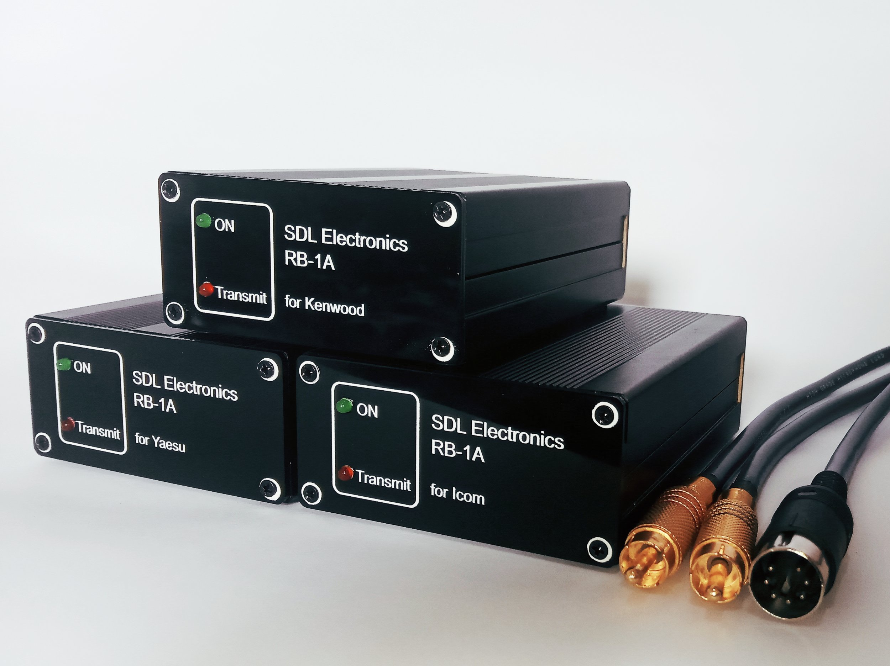
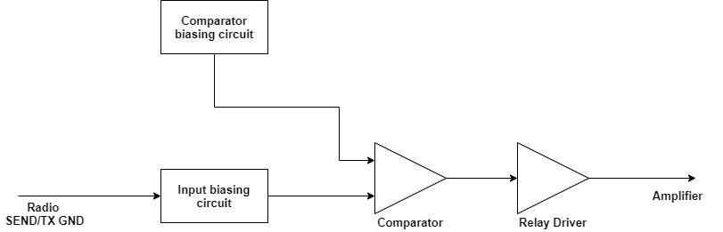
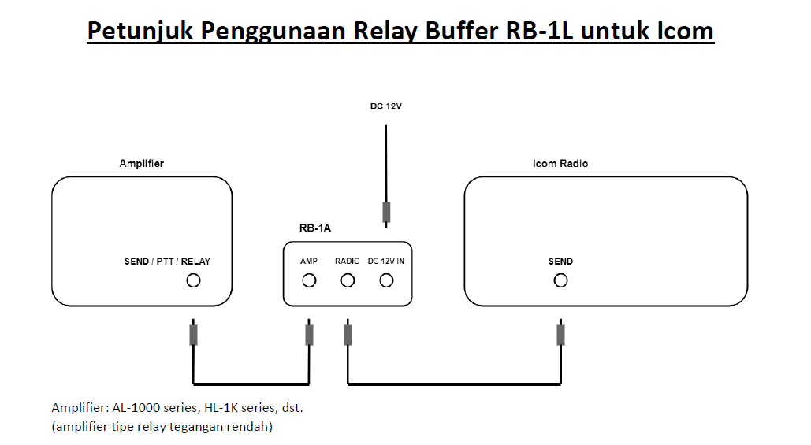

# Amplifier Relay Buffer

I make a new product. Actually, this is my first product which i publicly launched to the amateur radio community. Amplifier Relay Buffer is a device to protect your radio's PTT keying ciruit from external amplifier's back EMF voltage. I named my product as RB-1A/L. RB-1A model is targeted to high voltage external amplifiers (TL-922, etc) and RB-1L model is targeted to the low voltage external amplifiers (solid states, Ameritron's AL series, HL-1K series, etc).
Variants of this products are for Icom, Kenwood, and Yaesu radios.

RB-1A/L is successfully tested in TL-922, Alpha, HL-1K, and Ameritron AL811.

Actually, I am quite proud of this product. This is my first "serious" product which I spent many hours to design and thought about. Product appearance is quite nice (at least for me).

## Here's the product

## Functional block diagram

## How to connect RB-1A/L to the radio and amplifier

  
****

   
  <a href="https://handiko.github.io/MyBlog/"> Back to Home </a>
   

