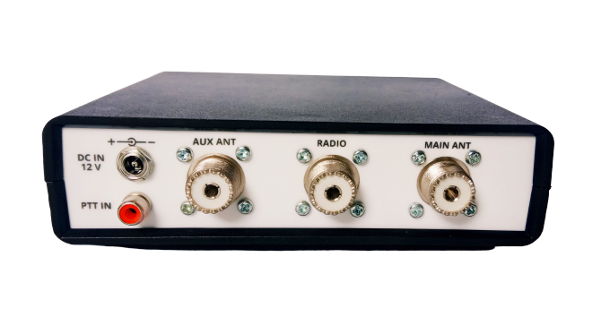

# NCL-100 RF Noise Canceller (Teaser)

RF Noise Canceller ini adalah salah satu product saya yang sedang dalam tahap testing. Saat ini saya belum secara resmi merilis produk ini karena saya sedang merancang desain yang lebih efektif dari batch produksi saat ini. Produk ini sebenarnya sudah dikerjakan sejak bulan September 2019 namum baru sempat saya selesaikan April ini. Saya sebenarnya saat entry ini ditulis, memiliki 3 jenis produk yang sedang dalam tahap produksi dan testing. See you soon!

 

[NCL-100 Instruksi Manual (rev1) - ID](./NCL-100_Manual.pdf)

**TNX es GUD DX**
**de YD1SDL, 2020**

#StayAtHome #MainRadiodiRumahAja

  
****

  <a href="https://handiko.github.io/MyBlog/"> <b>Back to Home</b> </a>
   

