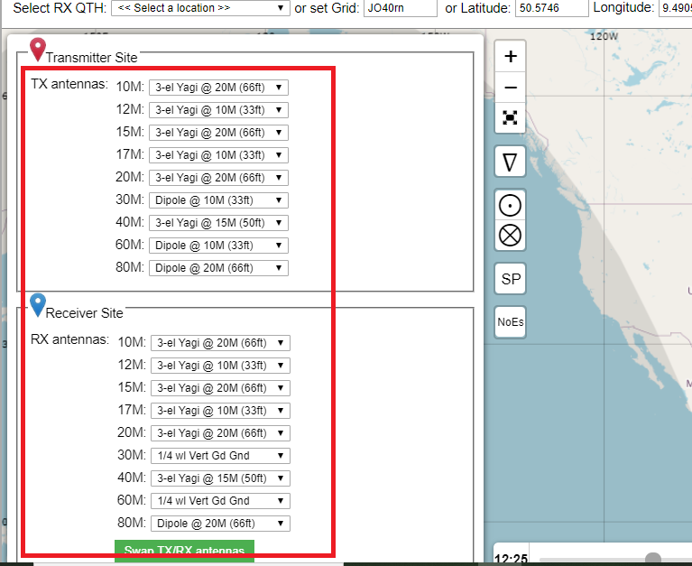

# Cara Melakukan Contest Planning menggunakan VOACAP Planner

TLDR: [https://www.voacap.com/hf/](https://www.voacap.com/hf/)

(perhatian: tulisan cukup panjang, harap siapkan kopi dan biskuit lebaran)

****

Berhubung event tahunan [**CQ WPX CW Contest 2020**](https://www.cqwpx.com/) semakin dekat (30-31 Mei 2020), saya kali ini mencoba berbagi sedikit pengetahuan yang saya gunakan saat mengikuti CQ WPX CW 2017 sehingga mampu mendapatkan hasil yang cukup baik bagi saya saat itu.
CQ WPX CW Contest adalah sebuah kontes amatir radio yang memiliki tantangan untuk mendapatkan skor tertinggi dengan cara mengumpulkan multiplier berupa prefix sebanyak mungkin (disamping jumlah QSO, cek [**rules**](https://www.cqwpx.com/rules.htm)). Bagi station dari Indonesia khususnya, CQ WPX sendiri sangat mengasyikan karena dalam satu country YB sendiri telah memiliki segudang multiplier (prefix YB0 - YG9, 7A0 - 7I9) sehingga mengumpulkan multiplier pun tidak terlalu sukar dan YB-land sendiri menurut saya termasuk region yang dipertimbangkan oleh contester luar karena ketersediaan multiplier yang melimpah ini sehingga oleh contester dari luar benua pun YB-land pasti cukup "diburu" oleh mereka yang membutuhkan multiplier tambahan.  

Untuk memperbesar **fun-factor** secara keseluruhan, bagi saya adalah penting untuk **memperketat persaingan** antar sesama contester dari YB-land (!) dengan cara membekali diri dengan pengetahuan yang cukup. Kenapa? Berikut alasannnya (at least menurut saya):
* Semakin ketat persaingan (secara sehat) akan meningkatkan standard skor rerata dari wilayah YB-land. Ini tentu adalah hal yang sangat baik. Skor rerata dari YB-land yang meningkat menandakan stok kontester dari YB-land adalah tidak kekurangan dan akan berpeluang menjadi penerus kontester handal YB-land di masa depan. Tentu ini adalah kabar yang sangat baik bagi masing-masing contest club yang masih merintis maupun yang telah established.
* Standard skor rerata yang meningkat juga akan meningkatkan peluang terpecahkannya rekor-rekor baru dari YB-land (!)
* Jumlah peminat contest dx dari Indonesia meningkat. Tentu ini adalah kabar yang sangat baik. Pertama, besarnya jumlah contester dari YB-land menjadi pertimbangan yang kuat bagi contest committee untuk menyediakan plakat tersendiri untuk Indonesia (!) Kedua, jumlah contester yang besar dari YB-land juga menjadi penambah **fun-factor**. Tentu teman-teman pernah mengalami kan bagaimana asyiknya contest dx di band 40M antara jam 0900 UTC hingga 1500 UTC begitu sesak dipenuhi oleh station YB-land? Saya sendiri pernah mengalami bagaimana asyiknya berburu multiplier dari station 7A2A di band 40M pada sore hari. Bayangkan, berburu multiplier dari **PJ4** di 7020 kHz dan pada frekuensi yang **hampir** sama (sekitar 7020.05 kHz) terdapat station YB yang sedang CQ. Sungguh mengasyikan (!)
* Jumlah peminat contest dx dari YB-land juga akan meningkatkan "gengsi" bagi YB-land. Paling tidak, bagi region ASEAN atau OCEANIA, YB-land akan menjadi daerah yang sangat diperhitungkan. Coba saja amati OCDX Contest atau riwayat penyelenggaraan YBDX Contest (!)
* Yang tak kalah penting adalah, knowledge-transfer antara sesama kontester YB-land akan terus terjaga sehingga dapat terjadi pertumbuhan skill secara umum pada masing-masing contester.

Okay. Lalu bagaimana cara kita untuk paling tidak membekali diri agar hasil contest menjadi semakin baik? Bagi saya, salah satu hal yang sangat penting adalah **Pengetahuan tentang propagasi**. Mengapa? Sebab kunci utama untuk mendapatkan skor yang tinggi adalah **mendapatkan jumlah multiplier yang tinggi** (tentu saja selain jumlah QSO). Lalu bagimana cara mendapatkan jumlah multiplier yang tinggi? Caranya adalah **harus tahu kapan multiplier tertentu muncul di band tertentu**. Tentu saja tidak menyenangkan jika station dari daerah Pulau Jawa mengarahkan beam antennanya ke 320 derajat pada band 40M jam 1100 - 1300 UTC, karena akan melewatkan kesempatan untuk mendapatkan multiplier dari South America (SA) dan region Caribbean yang waktu kemunculannya cukup terbatas. Atau melewatkan kesempatan pembukaan propagasi yang cukup luar biasa di band 40M antara pukul 2100 - 2300 UTC karena tidak tahu harus mengarahkan beam antenna ke mana. Atau melewatkan peluang bukaan propagasi di band 15M pada sekitar pukul 0900 UTC karena terlalu terburu-buru pindah ke band lain.

Sebenarnya selain pengetahuan propagasi, kita juga harus memiliki skill yang cukup tentang Pile-up handling, Hunting, Cara CQ, Pemanfaatan Contest Logger yang optimal, dll. Mengenai hal-hal tersebut dapat kita dikusikan di lain kesempatan. Sebagai contoh, tahun lalu saya baru mengetahui salah satu trik pile-up handling yang cukup efektif. Coba bayangkan, bagaimana caranya handling CW Pile-up dari Europe di band 80M saat CQ WW DX Contest 2019 sehingga hasil analisis UBN menunjukkan busted QSO "hanya" 6% dari total QSO di 80M band ? Busted QSO rate di band 80M bahkan lebih rendah dari 40M band. Sebagai catatan, YB-land pada 80M CW cukup "rare" sehingga kemunculan YB station saat DX Contest berpeluang membangkitkan pile-up yang cukup bikin kuping kita "tersiksa" 

Okay, back to topic ! Untuk meminimalisir diri kita melewatkan bukaan-bukaan propagasi yang sangat berharga tersebut, setidaknya terdapat dua cara yang dapat kita lakukan:
* Bekali diri dengan pengetahuan awal/dasar tentang propagasi. Pengetahuan awal ini (prior knowledge) dapat kita peroleh dari membaca, mengamati, atau mencoba tools tentang prediksi propagasi yang tersedia melimpah di internet.
* Tanya kepada yang lebih expert. Saya pribadi setiap sebelum kontes biasanya bertanya terlebih dahulu ke elmer saya mengenai kondisi propagasi secara umum dan petunjuk-petunjuk mengenai keadaan propagasi tiap band selama beberapa bulan terakhir. Hal ini akan mengkoreksi atau mengkonfirmasi prediksi propagasi yang telah kita peroleh dari poin sebelumnya.

****
## VOACAP Online dan VOACAP Planner
Salah satu online tool-set yang sering/selalu saya gunakan untuk perencanaan pra kontes adalah [**VOACAP Online**](https://www.voacap.com/hf/). Sebenarnya terdapat juga VOACAP versi Android apps tetapi saya tidak akan membahasnya di tulisan ini karena tidak terlalu lengkap dibanding versi online. VOACAP adalah himpunan beberapa perangkat (tool-set) yang dirancang oleh VOA (Voice Of America) untuk pemodelan propagasi ionospheric pada rentang shortwave. Dengan tool-set ini, kita dapat memprediksi kondisi propagasi pada tiap band dan tiap jam sehingga kita dapat memanfaatkannya untuk merencanakan arah beaming antenna selama kontes (bagian dari propagation management).

Konsep penggunaan VOACAP cukup sederhana, yaitu masukkan kondisi station kita pada VOACAP dan lakukan simulasi/prediksi. **Perlu diingat**, hasil prediksi VOACAP ini adalah **sebagai pegangan awal**, tidak selalu akurat, dan penyesuaian jadwal propagasi selama kontes hampir pasti dilakukan. Semakin banyaknya pengalaman akan semakin menentukan seberapa lancar kita melakukan penyesuaian mendadak saat kontes. Tentu saja memiliki pegangan awal yang tidak selalu akurat jauh lebih baik dibanding hanya membabi-buta menentukan arah beaming antenna selama kontes. Karena itu lah bertanya ke yang lebih ahli juga sangat penting. Telah melakukan persiapan yang cukup juga akan memberi efek booster secara psikologis sehingga akan lebih tenang dan menikmati kontes yang dilaksanakan.

### Menentukan Parameter Station untuk Prediksi VOACAP
VOACAP membutuhkan input parameter secara umum berupa kondisi station dan band. Mari kita asumsikan untuk pembahasan pada tulisan ini, kita sedang mengikuti kategori **Single Operator All Band High Power (SOAB HP)**, menggunakan Band 10M - 80M, dan antenna yang digunakan adalah:
* Yagi tri-bander 10-15-20. Jumlah active element pada masing-masing band diasumsikan 3 element.
* 2 Element Yagi 40M
* Rotary Dipole 80M 
* Power 1500 W (legal limit)
* Ketinggian antenna adalah 20m. Ketinggian yang cukup tipikal bagi rerata kontester.
* Semua antenna dapat diputar.
* Lokasi QTH adalah daerah pemukiman (tingkat noise cukup tinggi)

Parameter-parameter ini cukup tipikal bagi rerata amatir radio dari YB-land sehingga diharapkan pada tulisan ini dapat dihasilkan contoh yang cukup dapat diaplikasikan. Parameter-parameter tersebut juga akan kita aplikasikan pada kondisi stasiun DX sehingga dapat memberikan gambaran yang seakurat mungkin.

### Tampilan Awal VOACAP
Mari kita buka [**VOACAP Online**](https://www.voacap.com/hf/). Akan muncul tampilan awal sebagai berikut:

Terdapat beberapa hal penting pada tampilan awal VOACAP yang perlu diperhatikan:

* Pada bagian bertanda **"1"** adalah tempat kita memasukkan locator posisi station kita dan station DX. Pada kebutuhan umum, TX QTH adalah station kita, sedangkan RX QTH adalah station DX. Pengaturan tersebut berguna untuk prediksi coverage pancaran kita saat melakukan RUN (CQ-ing). Sedangkan pada saat kita melakukan S&P (Search-and-pounch / hunting) TX QTH adalah locator station DX dan RX QTH adalah station kita. Pada pembahasan di tulisan ini, kita hanya gunakan kondisi khusus yaitu hanya perlu memasukkan TX QTH yaitu locator station kita.
* Bagian bertanda **"2"** (biru) adalah titik RX QTH locator. 
* Bagian bertanda **"3"** (merah) adalah titik TX QTH locator. **"2"** dan **"3"** akan berubah saat kita merubah locator TX dan RX pada bagian **"1"** dan dapat kita geser dengan mouse. Garis/kurva antara **"2"** dan **"3"** berwarna HIJAU adalah lintasan **SHORT PATH** (SP) dan berwarna MERAH PUTUS-PUTUS adalah lintasan **LONG PATH** (LP). SP adalah lintasan terpendek antara station kita dan DX, sedangkan LP adalah lintasan terjauh antara station kita dan DX.
* Bagian bertanda **"4"** adalah tempat kita memasukkan parameter station. Bagian ini akan dijelaskan lebih lanjut.
* Bagian bertanda **"5"** adalah pilihan untuk melakukan penghitungan/prediksi untuk kasus SP atau LP. Untuk awalan, gunakan SP.
* Bagian yang berwarna cerah **"6"** adalah daerah bumi yang mengalami siang hari. 
* Bagian yang berwarna gelap **"7"** adalah daerah bumi yang mengalami malam hari. Keduanya penting karena untuk mengetahui pada bagian bumi tertentu/lokasi DX tertentu apakah sedang siang hari atau malam hari. Pada gambar di atas, YB-land sudah malam hari, namun EU masih siang hari. Sehingga pada saat tersebut, tentu saja CQ ke arah EU pada 40M adalah hal yang percuma. Namun, pada kondisi tersebut dapat dilihat karena Alaska dan pesisir barat USA masih terdapat daerah yang diliputi malam, propagasi 40M ke daerah tersebut masih memungkinkan. Dapat dilihat pula pada bagian kiri bawah terdapat slider jam UTC yang menunjukkan jam 1225 UTC.

### Memasukkan Parameter Station
* Pertama, masukkan QTH station kita pada kotak entri bagian atas atau geser marker MERAH pada peta hingga posisi marker berada pada lokasi station kita. Pada contoh, saya memasukkan QTH saya adalah OI33.

* Kedua, pilihan moda contest dan power pada bagian kanan atas.
* Ketiga, pilih Antennas pada bagian kanan atas dan kemudian akan muncul pilihan lanjutan di sebelah kiri

* Sesuai parameter station yang telah kita umpamakan pada bagian sebelumnya, pada "Transmitter Site" pilih **"3-el Yagi @ 20m"** untuk band 10, 15, dan 20M (tanda @ 20m menunjukkan ketinggian antenna), **"Dipole @ 20m"** untuk band 80M, dan pilih saja **"3-el Yagi @ 15m"** untuk band 40M. Karena pilihan 2-el Yagi @ 20m tidak tersedia, kita pilih saja **"3-el Yagi @ 15m"** dengan asumsi gain 2-el Yagi @ 20m sama dengan 3-el Yagi @ 15m. Abaikan pilihan pada band-band lain.
* Karena kita asumsikan kondisi station DX kira-kira sama dengan station kita, masukkan pilihan yang sama pada "Receiver Site".

* Keempat, pada bagian settings, dan sub-bagian General Propagation Settings, pilih Noise: Residential, SSN:-1, Method:Auto, dan Min.TOA:5 sebagai kasus terburuk. Abaikan isian settings yang lain untuk saat ini.

### Melakukan Kalkulasi Planner terhadap Parameter Station
* Jika isian-isian tersebut telah dilengkapi, scroll ke bagian bawah halaman, lalu pilih **"Planner"**.

* Setelah planner di-klik, akan terbuka jendela baru yang akan menunjukkan hasil kalkulasi/prediksi.

* Tunggu hingga hasil kalkulasi muncul sebagai berikut:

### Membaca dan Menerjemahkan Hasil Kalkulasi
* Mari kita amati lagi halaman hasil kalkulasi voacap planner. Pada halaman tersebut, hasil kalkulasi tiap-tiap band telah tersedia dan dapat di-klik untuk melihat hasilnya lebih lanjut.

* Sebagai contoh, mari kita klik untuk melihat hasil kalkulasi pada 10M band.

* Judul **"TX 6.48S, 107.04E via SP, May 2020"** memiliki arti bahwa TX location adalah pada koordinat 6.48S, 107.04E, Short Path (SP, lihat penjelasan tampilah awal VOACAP), dan kalkulasi dilakukan untuk bulan Mei 2020. Pada bagian atas tabel, terdapat angka **01 - 24**. Angka tersebut adalah **waktu UTC**. Pada bagian samping kiri tabel, terdapat **01 KL7** hingga **40 TF**. Itu adalah wilayah **CQ ZONE dan prefix yang mewakili**. Baris tabel yang diawali dengan **01 KL7** adalah hasil prediksi propagasi antara TX Locator menuju CQ Zone 1 atau Alaska (diwakili prefix KL7), dari **01 UTC** hingga **24 UTC**. Baris tabel yang diawali dengan **20 4X** adalah hasil prediksi propagasi antara TX Locator menuju CQ Zone 20 atau Israel (diwakili prefix 4X), dari **01 UTC** hingga **24 UTC**. Begitu pula baris tabel yang diawali dengan **40 TF** adalah hasil prediksi propagasi antara TX Locator menuju CQ Zone 40 atau Iceland (diwakili prefix TF), dari **01 UTC** hingga **24 UTC**.

* Warna-warna pada tabel tersebut menunjukkan seberapa kuat propagasi antara TX locator ke Zone-zone tersebut. MERAH TUA menunjukkan propagasi kuat/reliable dan BIRU MUDA menunjukkan propagasi lemah/unreliable. Sebagai contoh, Jika kita lihat pada baris **06 XE** (Mexico) terdapat propagasi cukup kuat pada jam 02 UTC dan TIDAK ADA PROPAGASI pada jam-jam lain(!) Begitu pula pada baris **20 4X** (Israel) menunjukkan terdapat bukaan propagasi cukup kuat hanya pada pukul 09-12 UTC.     

* Sebagai contoh lagi, jika kita lihat pada baris **25 JA** (Japan) diprediksi terdapat propagasi pada pukul 09-11 UTC. Jadi, jika kita ingin berburu segudang prefix dari JA-land (JA0-JS9, 7J0-7N9) pada band 10M, hanya dapat dilakukan pada jam-jam tersebut(!) Dari hasil tersebut dapat pula dilihat bahwa ternyata masih ada peluang untuk mendapatkan Canary Island (EA8, Zone 33) **33 EA8** pada pukul 13 UTC.   

* Jauh berbeda dengan 10M band, hasil prediksi pada 20M band menunjukkan peluang terbukanya propagasi yang jauh lebih besar. Pada band 20M dapat dikatakan hampir setiap jam terbuka propagasi paling tidak ke satu Zone.    

Dengan mempertimbangkan hasil untuk band 10M dan 20M saja, mulai terbayang gambaran mengenai keputusan **Pada jam berapa antenna harus beaming ke mana** untuk mendapatkan jumlah multiplier sebanyak mungkin. Ingat, band 10M hanya berpeluang terbuka sangat sedikit dan hanya pada jam-jam tertentu saja. Tidak terlalu masalah jika kita melewatkan bukaan propagasi 10M band ke Mexico (XE) atau Canary Island (EA8) karena pada Zone tersebut, jumlah prefix tidak banyak. Namun jangan sampai kita melewatkan bukaan propagasi 10M ke Japan yang merupakan salah satu sarang multiplier(!)

****
## Membuat Time Table Propagasi
Untuk memudahkan saat kontes berlangsung, seluruh hasil prediksi untuk band 10-80M dikompilasi menjadi time table (tabel waktu) yang telah merangkum peluang propagasi pada tiap jam dan keputusan prioritas band pada tiap jam (time table harus menjawab pertanyaan **"pada jam berapa harus berada di band berapa dan beaming ke mana"**). Untuk contoh pada tulisan ini, saya hanya menunjukkan cara membuat time table untuk jam 00 UTC (24 UTC pada VOACAP) hingga 12 UTC dan untuk band 10-20M (secara praktis, untuk kategori SOAB sebelum 12 UTC belum terlalu butuh untuk pindah ke 40M band).

* Menentukan region target. Tabel hasil prediksi VOACAP di atas terlalu besar untuk digunakan secara langsung selama kontes. Untuk memudahkan penggunaan, kita perlu mengelompokkan Zone-zone tersebut menjadi beberapa region yang cukup mewakili zone-zone di sekitarnya. Pengelompokkan tersebut dapat menggunakan batasan Continent/Sub-continent (OC, AS, NA, SA, EU, AF-north, AF-south), regional (US west coast, US east coast, Pacific, Caribbean, Scandinavia, Middle-east, Atlantic-africa), atau DXCC (Japan, Alaska, US, Canary Island). Pengelompokkan tersebut kemudian diwakili dengan **Prefix/DXCC Country** dan **arah beaming antenna**.
* Sebagai contoh, saya biasanya melakukan pengelompokkan sebagai berikut (beaming antenna ditunjukkan dari wilayah Pulau Jawa): 
   NA (North America), diwakili US, beaming ke 30-40 derajat (west coast)
   SA (South America), diwakili PY (Brazil), beaming ke 40-60 derajat
   Japan, beaming ke 30 derajat
   Asia, diwakili China, beaming ke 0 derajat
   Scandinavia, diwakili OH (Finland), beaming ke 330-340 derajat
   EU, diwakili DL (Germany), beaming ke 320 derajat
   Middle east, diwakili 4X (Israel), beaming ke 320 derajat
   Africa-north dan Canary Island, diwakili EA8 (Canary Is.), beaming ke 300-310 derajat
   Africa-south, diwakili ZS (South Africa), beaming ke 240 derajat
   Caribbean-Netherland Antilles, diwakili PJ4 (Bonaire), beaming ke 320 derajat (hi-band dan 40M sebelum sunrise) atau ke 30 derajat (40M band sebelum sunset)
   Caribbean-Cuba, diwakili CO (Cuba), beaming ke 30 derajat.

**TNX es GUD DX**
**de YD1SDL, 2020**

#StayAtHome #MainRadiodiRumahAja

****

  <a href="https://handiko.github.io/MyBlog/"> <b>Back to Home</b> </a>
   

