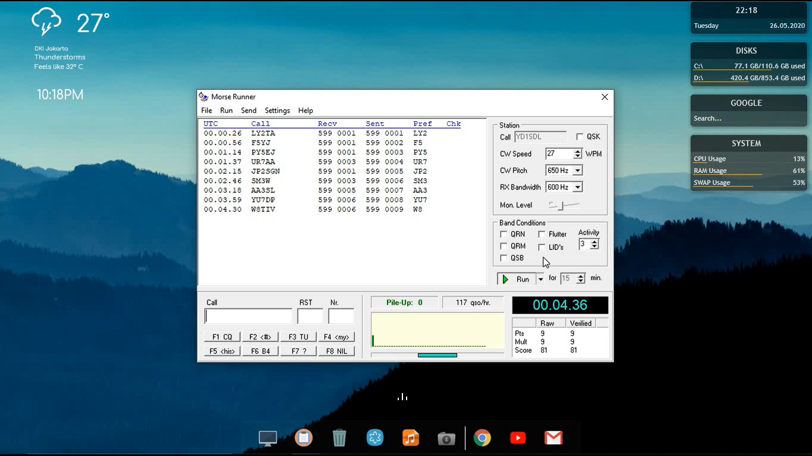

## YD1SDL Berlatih WPX CW Contest di Morse Runner

Sepertinya ini pertama kalinya saya melakukan rekaman latihan morse dengan style WPX CW Contest pada program Morse Runner. Sebenarnya saya tidak ada rencana untuk ikut WPX CW 2020 namun malam ini memutuskan untuk bermain-main sebentar dengan Morse Runner. Kali ini saya tidak menggunakan speed yang tinggi, cukup sedang-sedang saja sekitar 25-27 WPM. Tantangan QRM/QRN juga tidak saya aktifkan, begitu pula pile-up activity tidak saya setting begitu padat, cukup "3" saja. Kali ini adalah latihan yang cukup santai, cukup 15 menit saja (terekam hanya 8 menit agar video tidak terlalu panjang).

Klik gambar di bawah ini untuk langsung menuju YouTube. Enjoy!

**TNX es GUD DX**
**de YD1SDL, 2020**

#StayAtHome #MainRadiodiRumahAja

  
****

  <a href="https://handiko.github.io/MyBlog/"> <b>Back to Home</b> </a>
   

