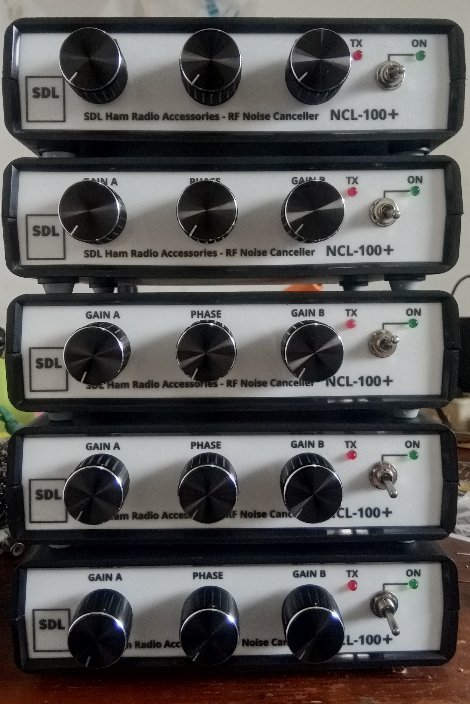
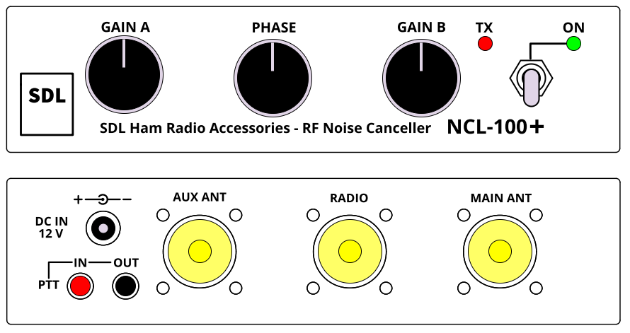

## Memperkenalkan NCL-100+

Awal bulan Agustus ini adalah awal yang pas untuk menyambut babak baru dalam produksi noise canceller. Pada awal bulan ini, saya memperkenalkan **NCL-100+** sebagai pengganti NCL-100 (NCL-100 sudah tidak lagi diproduksi dan sisa order secara otomatis dialihkan ke NCL-100+). Mulai saat ini, secara berangsur produksi Noise Canceller akan **dipercepat** dengan kapasitas produksi paling tidak 10 unit per minggu.

### Mengapa NCL-100+ ?
Pada dasarnya NCL-100+ adalah identik dengan NCL-100, namun dengan tambahan peningkatan dari versi sebelumnya, yaitu **Noise optimizer Circuit Block**. Rangkaian ini akan meningkatkan performa noise cancellation sehingga didapatkan hasil yang lebih baik dari NCL-100, yaitu posisi knop **Gain A** dalam kondisi "optimum noise cancelling" berada pada posisi lebih tinggi (searah jarum jam) sehingga meningkatkan kepekaan penerimaan secara signifikan. 
Bonus lainnya adalah terdapat extra female RCA connector **PTT** sehingga sinyal **PTT** dapat dicabang untuk perangkat lain (linear amplifier, foot switch, dsb).

Info lebih lanjut dapat menghubungi **YE1AR** 

### Tampilan NCL-100+

#### Panel depan

#### Panel baru NCL-100+

**TNX es GUD DX**
**de YD1SDL, 2020**

#StayAtHome #MainRadiodiRumahAja

  
****

  <a href="https://handiko.github.io/MyBlog/"> <b>Back to Home</b> </a>
   

