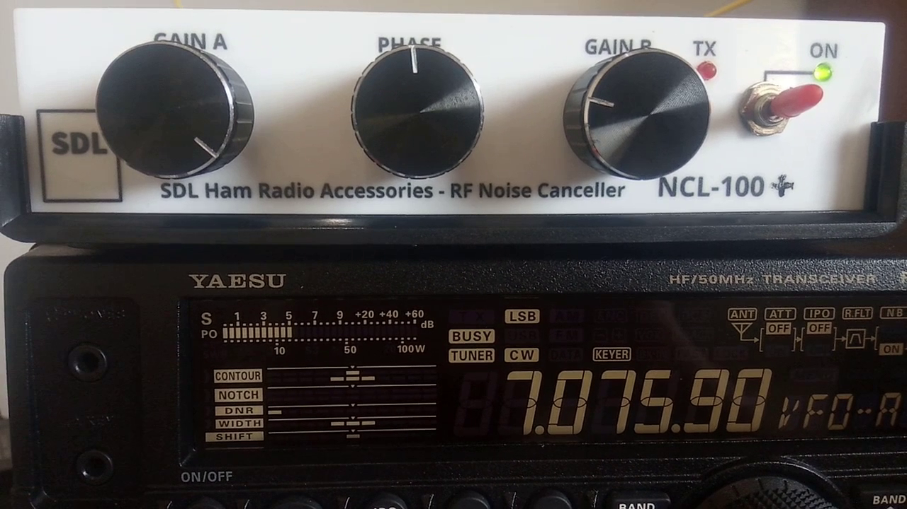

## Cara Menggunakan NCL-100 / NCL-100+

Video berikut menunjukkan cara mengatur knop Gain A, Gain B, dan Phase pada NCL-100/NCL-100+ (unit testing).

Demo NCL-100+ (unit testing) pada frekuensi FT8 40m band (antenna random wire).

**TNX es GUD DX**
**de YD1SDL, 2020**

#StayAtHome #MainRadiodiRumahAja

  
****

  <a href="https://handiko.github.io/MyBlog/"> <b>Back to Home</b> </a>
   

