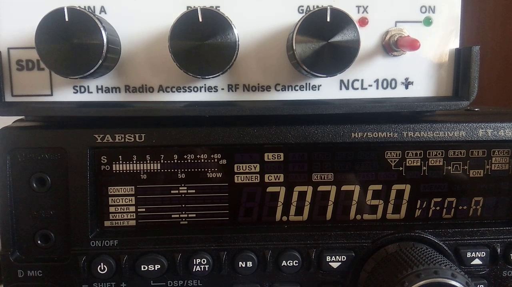
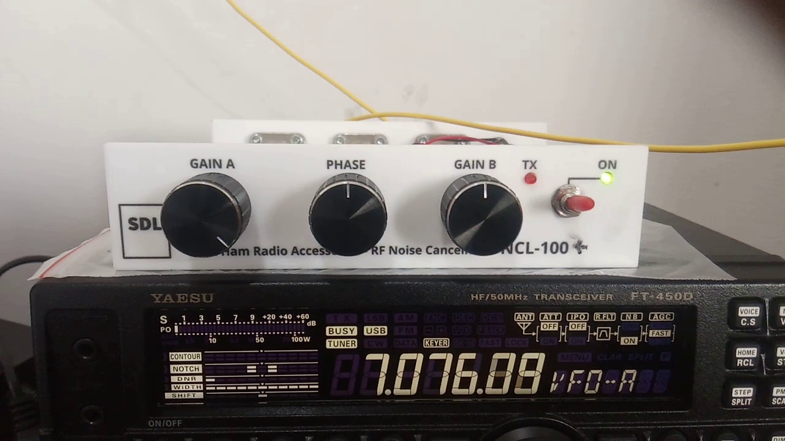

## Cara Pengaturan NCL-100 / NCL-100+

Untuk mendapatkan hasil yang terbaik dari NCL-100, pengaturan Gain A, B, dan Phase harus dilakukan dengan benar. Pengaturan tersebut perlu dilakukan setiap berpindah band. Berikut dua buah video atas NCL-100+ (unit testing) yang memperagakan cara pengaturan yang benar. Pada test tersebut, saya menggunakan dua buah antenna random wire masing-masing untuk Main dan Aux antenna.

### Cara mengatur knop Gain A, Gain B, dan Phase pada NCL-100/NCL-100+ (unit testing).

Klik gambar di bawah ini untuk langsung menuju YouTube.

### Demo NCL-100+ (unit testing) pada frekuensi FT8 40m band (antenna random wire).

Klik gambar di bawah ini untuk langsung menuju YouTube.

**TNX es GUD DX**
**de YD1SDL, 2020**

#StayAtHome #MainRadiodiRumahAja

  
****

  <a href="https://handiko.github.io/MyBlog/"> <b>Back to Home</b> </a>
   

