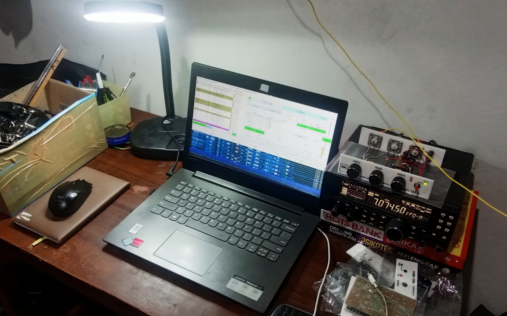

## ER4A Dimonitor Menggunakan INDOOR Random Wire Antenna dan Noise Canceller NCL-100+

Weekend ini saya sedikit iseng untuk mencoba memonitor segmen CW 40m band dengan radio Yaesu FT-450D saya dan random wire antenna INDOOR (saya belum sempat untuk mendirikan antenna semi permanen). Berbekal nekad dan Noise Canceller NCL-100+, saya coba nulling noise dari yang semula S-5 menjadi S-0. Tanpa disangka, hanya dengan indoor random wire antenna (panjang sekitar 5m) sebagai Main antenna dan juga sebuah random wire lain sebagai Aux antenna, ER4A _nyangkut_ di receiver saya dengan RST 559.

### Setup (Mini) Station
* 
* 

### Video 
* 

### Demo NCL-100+ (unit testing) pada frekuensi FT8 40m band (antenna random wire).

Klik gambar di bawah ini untuk langsung menuju YouTube.

**TNX es GUD DX**
**de YD1SDL, 2020**

#StayAtHome #MainRadiodiRumahAja

  
****

  <a href="https://handiko.github.io/MyBlog/"> <b>Back to Home</b> </a>
   

