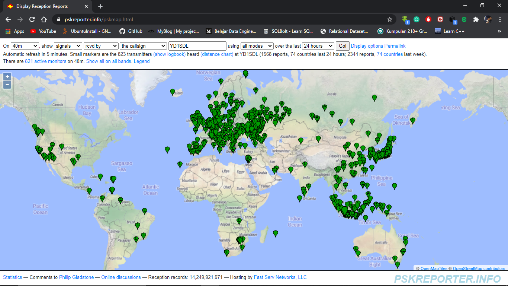

## Receiving FT8 Transmission Worldwide Using Indoor Antenna and NCL-100+

So basically, few days ago, i have some _crazy_ idea of "how about using this pathetic indoor antenna to receive FT8 at 40m band? How bad can it be?". Honestly, i don't expect much from this experiment. At that time, the local QRM level at 7074 kHz was S-8 to S-9 from time to time. Eventhough i was using NCL-100+ at that time, i was expecting to be receiving FT8 traffic from regional ASEAN + VK region. Japan at most. What do you expect from a short indoor antenna, huh? 

So i gave it a go.

I was using my FT-450D Yaesu transceiver, NCL-100+, random wire AUX antenna (thrown out the window), and a soundcard interface to connect my FT-450D SPK out to my laptop. I ran the JTDX software, set it on SWL mode, and enable the pskreporting feature.
The experiment was conducted between August 13 2020 - 10 UTC (evening) and about 2 UTC the next day (less than 24 hours).

I set the NCL-100+ to gave me about S-0 to S-1 noise reading and i left it running.

After a few hours, i shocked when i checked the pskmap from pskreporter that my receiving station can receive a lot and lots(!) of JA station and some US station from west coast. Hmmm... interesting.. 
"This looks promising", i thought. So i left it running for another few hours. 
At about 15 UTC, i checked pskreporter again, and i saw another USA station received and even HK6G from Colombia at quite good SNR (about -11 dB of SNR). Wow..!! Colombia is practically at my antipodal location and i just receiving it using an indoor antenna! 

"Can I receive a lot of EU with this setup? Maybe, but i don't think so", i thought.
So, i just left it all night long running and i checked in the next morning.

Here the pskmap from the psk reporter:

Impressive huh? This 800 hundred stations and 74 countries was received using my indoor antenna. Wow.

**TNX es GUD DX**
**de YD1SDL, 2020**

#StayAtHome #MainRadiodiRumahAja

  
****

  <a href="https://handiko.github.io/MyBlog/"> <b>Back to Home</b> </a>
   

