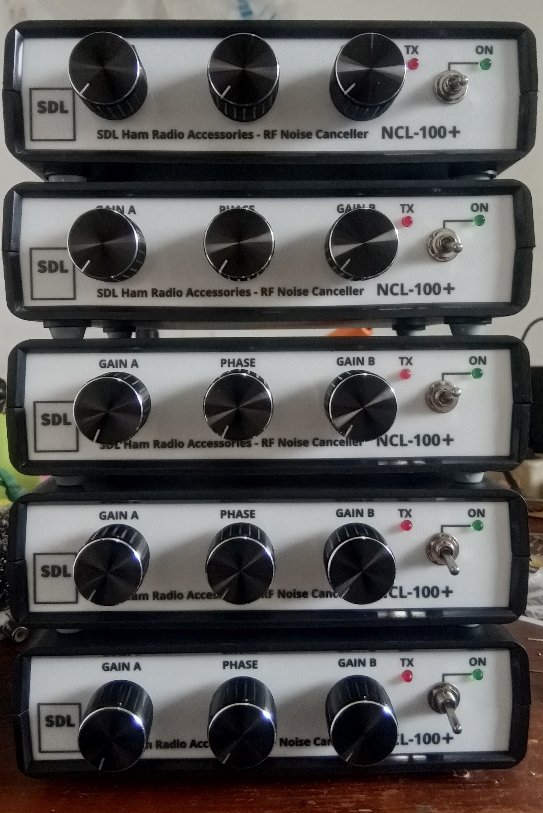

Melalui halaman ini, saya secara berkala akan memberikan status update terkait pesanan atas produk-produk saya.

**UPDATE 1 Agustus 2020**

**Memperkenalkan NCL-100+ !!**

Awal bulan Agustus ini adalah awal yang pas untuk menyambut babak baru dalam produksi noise canceller. Pada awal bulan ini, saya memperkenalkan **NCL-100+** sebagai pengganti NCL-100 (NCL-100 sudah tidak lagi diproduksi dan sisa order secara otomatis dialihkan ke NCL-100+). Mulai saat ini, secara berangsur produksi Noise Canceller akan **dipercepat** dengan kapasitas produksi paling tidak 10 unit per minggu. 

* [**Penjelasan singkat NCL-100+** << klik](../2020-08-01/2020-08-01.md)
* [**Cara Pengaturan NCL-100/NCL-100+** << klik](../2020-08-02/2020-08-02.md)
* [**NCL-100 Instruksi Manual (rev1) - ID**](./NCL-100_Manual_rev1_ID.pdf)
* [**NCL-100+ Quick User Guide - EN**](https://github.com/handiko/MyBlog/blob/master/2020-08-17/NCL-100_NCL-100%2B_Quick_User_Guide_EN.pdf).

## NCL-100/NCL-100+ Demo Video

* [Test oleh YE1AR](https://www.youtube.com/watch?v=0mTeQIkwuYI)
* [Cara Pengaturan NCL-100/NCL-100+ oleh YD1SDL (unit testing)](https://www.youtube.com/watch?v=hh-UnCXkkAk)
* [Demo Noise Cancelling NCL-100+ (unit testing) - FT8 40m](https://www.youtube.com/watch?v=3st1Q91vHDI)
* [ER4A Received Using **INDOOR** Random Wire Antenna and NCL 100+ Noise Canceller](https://www.youtube.com/watch?v=tYu9P_CExKg)
* [8A524PO Received Using Random Wire and NCL 100+](https://www.youtube.com/watch?v=3DPC6se2oCM)

**Ordering info:** via YE1AR

[Beberapa Foto Pengiriman (tidak semua foto akan saya upload di sini)](./FotoKirim/FotoKirim.md)

# NCL-100 - RF Noise Canceller - Order Update

|Nomor Antrian|Pemesan|Antri|Dikerjakan|Selesai|Dikirim|
|:-----------:|:-----:|:---:|:--------:|:-----:|:-----:|
|1            |YB6HAI |      |          |       |   V   |
|2            |YB9UA  |      |          |       |   V   |
|3            |YB9JAU |      |          |       |   V   |
|4            |YC9FZ  |      |          |       |   V   |
|5            |YB1KS  |      |          |       |   V   |
|6            |YC0BAS |      |          |       |   V   |
|7            |YC1GHZ |   -  |          |       |       |
|8            |YB0NSI |      |    V     |       |       |
|9            |Mail Bekasi |     |          |       |   V   |
|10           |YC2FLA |     |          |       |   V   |
|11           |YD9VE  |     |          |       |   V   |
|12           |YD1RIK |     |          |       |   V   |
|13           |YE1BNI |     |          |       |   V   |
|14           |YC9AM  |     |          |       |   V   |
|15           |YC2ILU |     |          |       |   V   |
|16           |YB3HQM |     |          |       |   V   |
|17           |YE4IJ  |     |          |       |   V   |
|18           |YB1MIG |     |          |       |   V   |
|19           |YF3EKS |     |          |       |   V   |
|20           |**YD1RQX** |     |          |       |   V   |
|21           |9W2FSY |     |          |       |   V   |
|22           |YC7TUU |     |          |       |   V   |
|23           |YD1DWD |     |          |       |   V   |
|24           |YB2TS  |     |          |       |   V   |
|25           |YB7WW  |     |          |       |   V   |
|26           |anonim |     |          |       |   V   |
|27           |YF5RFU |  -  |          |       |       |
|28           |YC0XTU |     |          |       |   V   |
|29           |**YB7XMR** |     |          |       |   V   |
|30           |**YD0UBW** |     |          |       |   V   |
|31           |**YB0ET**  |     |          |   V   |       |
|32           |**YB0NDN** |     |          |   V   |       |
|33           |**YB0JVZ** |     |          |   V   |       |
|34           |**YB3LZ**  |     |          |   V   |       |
|35           |YB2HKB |  V  |          |       |       |
|36           |YC1BIQ |  V  |          |       |       |
|37           |YD7GTQ |  V  |          |       |       |
|38           |YD1GMA |  V  |          |       |       |
|39           |YC7UVB |  V  |          |       |       |
|40           |YC7YGR |  V  |          |       |       |
|41           |**YC8AO**  |     |          |       |   V   |
|42           |YD1GMQ |  V  |          |       |       |
|43           |YF7MY  |  V  |          |       |       |
|44           |YD1DPK |  V  |          |       |       |
|45           |YB7MD  |  V  |          |       |       |
|46           |YB2YEN |  V  |          |       |       |
|47           |YD7HPF |  V  |          |       |       |
|48           |YB9AY  |  V  |          |       |       |
|49           |YB3PHH |  V  |          |       |       |
|50           |YB4AS  |  V  |          |       |       |
|51           |YB1PEF |  V  |          |       |       |
|52           |YC5MB  |  V  |          |       |       |
|53           |YB2BNN |  V  |          |       |       |
|54           |YB1BRS |  V  |          |       |       |
|55           |YB6MIX |  V  |          |       |       |
|56           |YB2VYY |  V  |          |       |       |
|57           | -     |  -  |          |       |       |
|58           |YC9DCK |  V  |          |       |       |
|59           |YB6VK  |  V  |          |       |       |
|60           |YC1KK  |  V  |          |       |       |
|61           |YB1DNF |  V  |          |       |       |
|62           |YB1BA  |  V  |          |       |       |
|63           |YF5YUD |  V  |          |       |       |
|64           |YB1DUU |  V  |          |       |       |
|65           |YF9CZY |  V  |          |       |       |
|66           |YB1SKR |  V  |          |       |       |
|67           |YC3RJL |  V  |          |       |       |
|68           |YB2HAF |  V  |          |       |       |
|69           |YD2CPG |  V  |          |       |       |
|70           |YB3BGM |  V  |          |       |       |
|71           |YB7MRK |  V  |          |       |       |
|72           |YB5DL  |  V  |          |       |       |
|73           |YC5TEB |  V  |          |       |       |
|74           |YC3TEN |  V  |          |       |       |
|75           |YD2AYA |  V  |          |       |       |
|76           |YB0VB  |  V  |          |       |       |
|77           |YB6ESO |  V  |          |       |       |
|78           |YD9BHJ |  V  |          |       |       |
|79           |*__V85AHV__* |     |          |       |   V   |
|80           |YD1JNV |  V  |          |       |       |
|81           |YB1EME |  V  |          |       |       |
|82           |YC9BCD |  V  |          |       |       |
|83           |YB8RP  |  V  |          |       |       |
|84           |YD1HAY |  V  |          |       |       |
|85           |YB9YGB |  V  |          |       |       |
|86           |YB4LVF |  V  |          |       |       |
|87           |YD8KCA |  V  |          |       |       |
|88           |YD3EXW |  V  |          |       |       |
|89           |YC1INQ |  V  |          |       |       |
|90           |*__OM3JW__* |     |          |       |   V   |
|91           |YB6XFI/7|  V  |          |       |       |
|92           |YC9RON |  V  |          |       |       |
|93           |YD8RSJ |  V  |          |       |       |
|94           |YD3RDO |  V  |          |       |       |
|95           |YC9VCQ |  V  |          |       |       |
|96           |*__SP5X__*   |  V  |          |       |       |
|97           |YB3TE  |  V  |          |       |       |
|98           |YB3TE  |  V  |          |       |       |
|99           |YC0HLE |  V  |          |       |       |
|100          |YB1KKK |  V  |          |       |       |
|101          |JZ29BNL|  V  |          |       |       |
|102          |YC3WKX |  V  |          |       |       |
|103          |*__HK1X__*   |  V  |          |       |       |
|104          |*__HK1X__*   |  V  |          |       |       |
|105          |*__OE6VIE__*|  V  |          |       |       |
|106          |*__TG9AHM__*|  V  |          |       |       |
|107          |*__9M8DEN__*|  V  |          |       |       |
|108          |*__9M8DEN__*|  V  |          |       |       |
|109          |*__9M8ADX__*|  V  |          |       |       |
|110          |*__9W8ZZK__*|  V  |          |       |       |
|111          |YD3ERZ |  V  |          |       |       |
|112          |YB3OIB |  V  |          |       |       |
|113          |YD2BIS |  V  |          |       |       |
|114          |       |     |          |       |       |
|115          |       |     |          |       |       |
|116          |       |     |          |       |       |
|117          |       |     |          |       |       |
|118          |       |     |          |       |       |
|119          |       |     |          |       |       |
|120          |       |     |          |       |       |

****

**TNX es GUD DX**
**de YD1SDL, 2020**

#StayAtHome #MainRadiodiRumahAja

  
****

  <a href="https://handiko.github.io/MyBlog/"> <b>Back to Home</b> </a>
   

