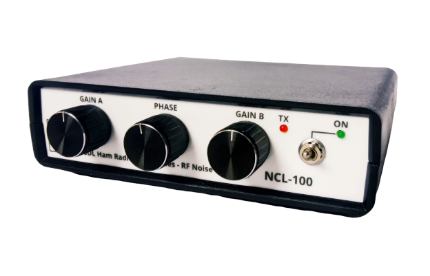

# NCL-100 RF Noise Canceller

Saya telah melakukan beberapa peningkatan terhadap NCL-100 versi awal. 

-to be continued-

 

[NCL-100 Instruksi Manual (rev1) - ID](./NCL-100_Manual.pdf)

**TNX es GUD DX**
**de YD1SDL, 2020**

#StayAtHome #MainRadiodiRumahAja

  
****

  <a href="https://handiko.github.io/MyBlog/"> <b>Back to Home</b> </a>
   

